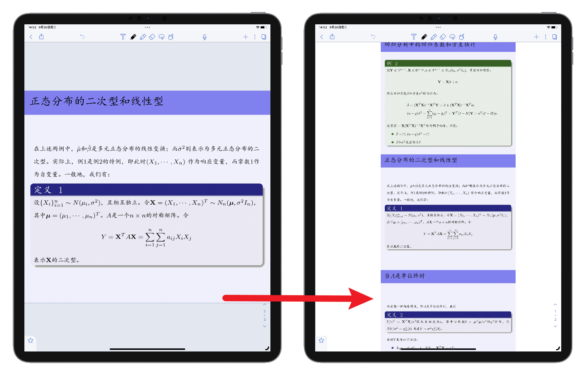

# 课件重排工具

某免费 PDF 转换站点 API 逆向，用于将 PPT 课件重排为无边距的 A4 幅面 PDF 文件用于在 iPad Pro 上批注（支持定制）。

## 安装依赖

在使用本工具前，请确保已安装`requests`库。

## 使用方法

调用方式如下：

```
python reformatter.py filename [outputfilename]
```

其中，`filename`为待处理的PDF文件名，`outputfilename`为可选参数，表示输出文件名。如果不提供`outputfilename`，则会使用默认的输出文件名。

## 格式化选项

要自定义格式化选项，请参考`request_body.json`文件内的参数。

以下是已定义的参数及其解释：

- `'layout_border': '0'`: PDF页面布局：无边框
- `'layout_mode_multiple_pages_per_sheet': '3'`: PDF页面布局：每页显示的幻灯片数量
- `'layout_page_orientation': 'portrait'`: 页面布局：PDF页面的方向（纵向）
- `'layout_inner_margin': '0'`: 内边距：页面之间的间距
- `'layout_outer_margin': '0'`: 外边距：内容与页面边缘之间的间距

效果预览：


